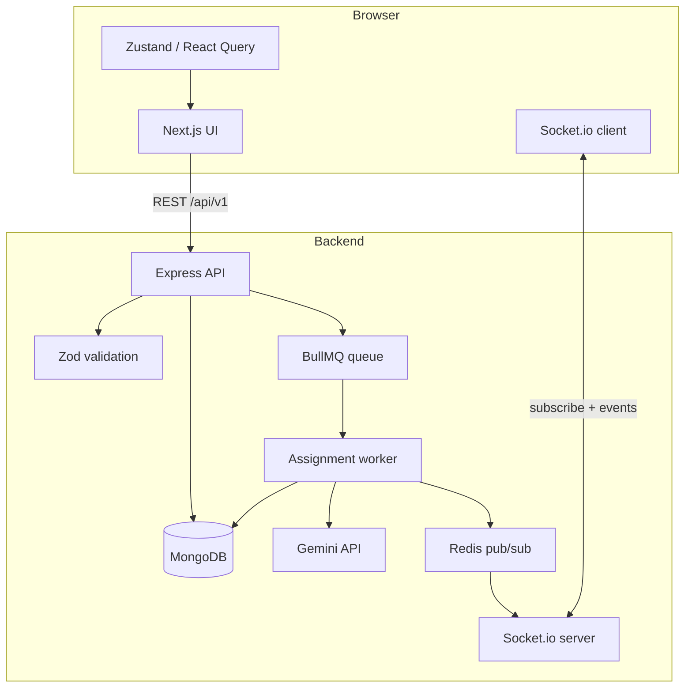

# VedaAI - AI Assessment Creator

Teachers create assignments through a guided flow; the backend queues AI work, generates a structured question paper with **Gemini**, and pushes status updates over **Socket.io** so the paper can appear **without a manual refresh**. Output includes sectioned questions, **difficulty tags** (easy / moderate / challenging), marks, an **answer key**, and **PDF** generation or download when needed.

---

## What it does

1. Teacher fills the form  subject, class, school, due date, question types (counts and marks), optional instructions and reference files.
2. **Generate** queues a BullMQ job and persists the assignment in MongoDB.
3. The worker calls **Google Gemini** (JSON mode), validates the result, and saves the generated paper.
4. Status changes are published via Redis; the API emits **Socket.io** events to clients subscribed to that assignment.
5. The UI shows progress, then renders the paper; users can generate or fetch a **PDF** through dedicated endpoints.

---

## Tech stack


| Layer               | Technology                                                                 |
| ------------------- | -------------------------------------------------------------------------- |
| Frontend            | Next.js 16 (App Router), React 19, TypeScript, Tailwind CSS                |
| Client state & data | Zustand, TanStack React Query, Axios                                       |
| Realtime            | Socket.io (client ↔ same host as API)                                      |
| Backend             | Node.js, Express 5, TypeScript                                             |
| Validation          | Zod                                                                        |
| Database            | MongoDB, Mongoose                                                          |
| Queue & cache       | BullMQ, Redis (ioredis)                                                    |
| AI                  | Google Gemini (`@google/generative-ai`, model configurable via `AI_MODEL`) |
| Uploads             | Multer (images, PDF, Word — limits in env)                                 |


---

## Architecture

High-level data flow:




- **REST** handles CRUD, file upload, PDF, and health checks under a single `**/api/v1`** prefix.
- **BullMQ** decouples HTTP from long-running generation. The API starts the worker **in-process** by default (fits a single free-tier web service, e.g. Render); you can run a **standalone** worker with `npm run dev:worker` / `npm run start:worker` when you split processes.
- **Redis** backs both the queue and a small pub/sub channel so HTTP workers can notify the Socket.io layer when assignment status changes.

### Repository layout


| Directory   | Role                                                                        |
| ----------- | --------------------------------------------------------------------------- |
| `frontend/` | Next.js app: dashboard, create flow, assignment detail, shared UI           |
| `backend/`  | Express app, Mongoose models, BullMQ worker, AI and PDF services, Socket.io |


---

## Prerequisites

- **Node.js** (LTS recommended)
- **MongoDB** (local or hosted URI)
- **Redis** (for BullMQ queues)
- **Google Gemini API key** ([Google AI Studio](https://aistudio.google.com/apikey))

## Backend setup

1. Install dependencies and configure environment:
  ```bash
   cd backend
   npm install
   cp .env.example .env
  ```
2. Edit `.env` and set at least:
  - `MONGODB_URI` — e.g. `mongodb://localhost:27017/vedaai`
  - `REDIS_URL` — e.g. `redis://localhost:6379`
  - `GEMINI_API_KEY` — your Gemini key
  - `CORS_ORIGINS` — include your frontend origin (default includes `http://localhost:3000`)
3. Run in development (API + in-process assignment worker + WebSocket server):
  ```bash
   npm run dev
  ```
   The API listens on **port 4000** by default, with routes under `**/api/v1`** (e.g. `/api/v1/assignments`, `/api/v1/health`).

### Other backend scripts


| Script                 | Purpose                                                         |
| ---------------------- | --------------------------------------------------------------- |
| `npm run build`        | Compile TypeScript to `dist/`                                   |
| `npm start`            | Run compiled server                                             |
| `npm run dev:worker`   | Run only the assignment worker (separate terminal from the API) |
| `npm run start:worker` | Production worker entry                                         |


> **Worker vs server:** The assignment worker runs **in the same process** as the HTTP server by default (`backend/src/server.ts`). That keeps **one** deployable unit—handy for platforms with a **single free web service** (e.g. [Render](https://render.com) free tier). The worker can also run **on its own** with `npm run dev:worker` (dev) or `npm run start:worker` (production) when you split API and worker across processes or machines.

## Frontend setup

1. Install and configure:
  ```bash
   cd frontend
   npm install
   cp .env.example .env.local
  ```
2. Point `.env.local` at your backend (defaults assume backend on port 4000):
  - `NEXT_PUBLIC_API_URL`
3. Start the dev server:
  ```bash
   npm run dev
  ```
   Open [http://localhost:3000](http://localhost:3000).

### Frontend scripts


| Script          | Purpose           |
| --------------- | ----------------- |
| `npm run dev`   | Next.js dev       |
| `npm run build` | Production build  |
| `npm start`     | Production server |
| `npm run lint`  | ESLint            |


---

## API reference

Base URL: `http://<host>:4000` (default). JSON routes use prefix `**/api/v1**`. Responses follow `{ success, data, error, meta }` unless noted.


| Method   | Route                                | Description                                                                                                                                           |
| -------- | ------------------------------------ | ----------------------------------------------------------------------------------------------------------------------------------------------------- |
| `GET`    | `/`                                  | Service metadata (`vedaai-backend`, version)                                                                                                          |
| `GET`    | `/api/v1/health`                     | Liveness: MongoDB, Redis, queue checks. Query `verbose=true` for details. Returns `503` if degraded.                                                  |
| `GET`    | `/api/v1/assignments`                | Paginated list. Query: `page`, `limit`, `search`, `status` (`draft` | `queued` | `processing` | `completed` | `failed`), `sort` (e.g. `-createdAt`).  |
| `POST`   | `/api/v1/assignments`                | Create assignment and enqueue generation. **Multipart**: text fields + optional files field `materialFiles` (up to `MAX_UPLOAD_FILES`). Rate-limited. |
| `GET`    | `/api/v1/assignments/:id`            | Single assignment including generated content when completed.                                                                                         |
| `DELETE` | `/api/v1/assignments/:id`            | Soft-delete assignment.                                                                                                                               |
| `POST`   | `/api/v1/assignments/:id/regenerate` | Queue a new generation run for an existing assignment.                                                                                                |
| `POST`   | `/api/v1/assignments/:id/pdf`        | Generate/store PDF for the assignment.                                                                                                                |
| `GET`    | `/api/v1/assignments/:id/pdf`        | Download generated PDF.                                                                                                                               |


### Realtime (Socket.io)

Connect the client to the same origin as `NEXT_PUBLIC_WS_URL` (e.g. `http://127.0.0.1:4000`). After connection, emit `**subscribe:assignment`** with the assignment id (string or `{ assignmentId }`) to join the room.

The server emits event names `**assignment:<status>**` where `<status>` is one of: `queued`, `processing`, `completed`, `failed`. Payload shape:

```json
{
  "assignmentId": "<mongoObjectId>",
  "status": "processing",
  "timestamp": "2025-03-22T12:00:00.000Z"
}
```

Use `**unsubscribe:assignment**` with the same id to leave the room.

---

## Environment reference

Full lists: `**backend/.env.example**` and `**frontend/.env.example**`.