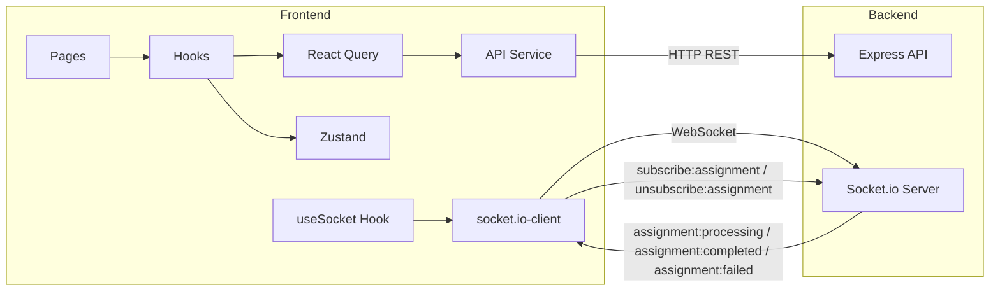

# VedaAI Frontend Implementation Plan

---

## Tech Stack

- **Next.js 15** (App Router)
- **TypeScript**
- **Tailwind CSS 4** + **shadcn/ui** (for Date Picker, Dropdown, Dialog, etc.)
- **Zustand** (client state for multi-step form)
- **TanStack React Query v5** (server state, API caching)
- **Socket.io-client** (real-time assignment status updates)
- **Zod** (form validation -- mirrors backend schemas)
- **react-hot-toast** (notifications)
- **lucide-react** (icons, matches shadcn defaults)

---

## Folder Structure

```
frontend/
├── app/
│   ├── layout.tsx                    # Root layout (providers, fonts)
│   ├── page.tsx                      # Redirect to /assignments
│   ├── globals.css                   # Tailwind directives + custom vars
│   ├── (dashboard)/
│   │   ├── layout.tsx                # Sidebar + Header shell
│   │   ├── assignments/
│   │   │   ├── page.tsx              # Dashboard: list / empty state
│   │   │   ├── create/
│   │   │   │   └── page.tsx          # Multi-step create form
│   │   │   └── [id]/
│   │   │       └── page.tsx          # Assignment output / viewer
│   │   └── home/
│   │       └── page.tsx              # Home (placeholder)
│   └── providers.tsx                 # QueryClientProvider, Toaster, SocketProvider
├── components/
│   ├── ui/                           # shadcn/ui primitives (button, input, etc.)
│   ├── layout/
│   │   ├── sidebar.tsx               # Left sidebar nav
│   │   ├── header.tsx                # Top bar (breadcrumb, user avatar, bell)
│   │   └── mobile-nav.tsx            # Bottom tab bar (mobile)
│   ├── assignments/
│   │   ├── assignment-card.tsx       # Card with title, dates, 3-dot menu
│   │   ├── assignment-grid.tsx       # Grid of cards + search + filter
│   │   ├── empty-state.tsx           # "No assignments yet" UI
│   │   ├── assignment-output.tsx     # Full generated paper view
│   │   └── pdf-download-button.tsx   # "Download as PDF" button
│   └── create-assignment/
│       ├── stepper.tsx               # Step indicator (optional)
│       ├── step-details.tsx          # Step 1: upload, due date, chapter
│       ├── step-questions.tsx        # Step 2: question builder
│       ├── question-type-row.tsx     # Single question type config row
│       └── file-upload.tsx           # Drag-and-drop file upload zone
├── store/
│   └── create-assignment-store.ts    # Zustand store for multi-step form state
├── services/
│   └── api.ts                        # Axios/fetch instance + endpoint functions
├── hooks/
│   ├── use-assignments.ts            # React Query hooks (list, get, create, delete)
│   └── use-socket.ts                 # Socket.io connection + event listeners
├── lib/
│   ├── utils.ts                      # cn() helper, date formatters
│   ├── constants.ts                  # Question types, nav items, etc.
│   └── socket.ts                     # Socket.io singleton
├── types/
│   └── assignment.ts                 # Shared TS types (mirrors backend model)
├── validators/
│   └── assignment.ts                 # Zod schemas for client-side validation
├── next.config.ts
├── tailwind.config.ts
├── tsconfig.json
├── package.json
└── .env.local                        # NEXT_PUBLIC_API_URL, NEXT_PUBLIC_WS_URL
```

---

## Architecture and Data Flow



---

## STEP 1 -- Project Scaffolding

**Goal**: Get a running Next.js app with all dependencies installed and shadcn/ui ready.

**Actions**:

1. Run `npx create-next-app@latest frontend` with TypeScript, Tailwind CSS, App Router, `src/` disabled
2. Install runtime deps: `@tanstack/react-query zustand socket.io-client zod react-hot-toast lucide-react date-fns`
3. Run `npx shadcn@latest init` (New York style, neutral theme)
4. Add shadcn components: `button input select calendar popover dropdown-menu dialog badge card separator textarea`
5. Create `.env.local` with `NEXT_PUBLIC_API_URL=http://localhost:4000/api/v1` and `NEXT_PUBLIC_WS_URL=http://localhost:4000`
6. Verify the app runs with `npm run dev`

**Files created**: `package.json`, `next.config.ts`, `tsconfig.json`, `tailwind.config.ts`, `app/layout.tsx`, `app/globals.css`, `.env.local`, `components/ui/*`

---

## STEP 2 -- Types and Validators

**Goal**: Define all TypeScript interfaces and Zod schemas matching the backend data model.

**Actions**:

1. Create `types/assignment.ts` -- mirrors `backend/src/types/assignment.ts` and `backend/src/models/assignment.model.ts`:
   - `QuestionConfig` (type, count, marks)
   - `GeneratedQuestion` (text, difficulty, marks)
   - `GeneratedSection` (title, instructions, questions)
   - `GeneratedPaper` (header, studentSection, sections, answerKey)
   - `Assignment` (full model with all fields)
   - `AssignmentListItem` (subset returned by list endpoint)
   - `ApiResponse<T>` (success, data, error, meta)
   - `PaginationMeta` (page, limit, totalItems, totalPages)

2. Create `validators/assignment.ts` -- mirrors `backend/src/validators/assignment.validator.ts`:
   - `createAssignmentSchema` (Zod object for form validation)

3. Create `lib/constants.ts`:
   - `QUESTION_TYPES` array (Multiple Choice, Short Questions, Diagram/Graph-Based, Numerical Problems)
   - `NAV_ITEMS` array (icon, label, href)
   - `ASSIGNMENT_STATUSES` enum

**Files created**: `types/assignment.ts`, `validators/assignment.ts`, `lib/constants.ts`

---

## STEP 3 -- API and Socket Services

**Goal**: Centralized HTTP client and WebSocket connection factory.

**Actions**:

1. Create `services/api.ts`:
   - Base `apiFetch<T>()` wrapper using native fetch, reads `NEXT_PUBLIC_API_URL`
   - `listAssignments(params)` -- GET `/assignments` with query params
   - `getAssignment(id)` -- GET `/assignments/:id`
   - `createAssignment(formData)` -- POST `/assignments` with FormData (multipart)
   - `deleteAssignment(id)` -- DELETE `/assignments/:id`
   - `regenerateAssignment(id)` -- POST `/assignments/:id/regenerate`
   - `generatePdf(id)` -- POST `/assignments/:id/pdf` (triggers server-side PDF generation)
   - `downloadPdfUrl(id)` -- returns the URL string `/assignments/:id/pdf` for direct download via `<a>` tag or `window.open`

2. Create `lib/socket.ts`:
   - Lazy singleton `getSocket()` using `socket.io-client`, connects to `NEXT_PUBLIC_WS_URL`
   - Auto-reconnect configuration

3. Create `lib/utils.ts`:
   - `cn()` helper (clsx + tailwind-merge)
   - `formatDate()` helper using date-fns

**Files created**: `services/api.ts`, `lib/socket.ts`, `lib/utils.ts`

---

## STEP 4 -- State Management (Zustand + React Query Hooks)

**Goal**: All client and server state wired up, ready for pages to consume.

**Actions**:

1. Create `store/create-assignment-store.ts`:
   - Zustand store with `step`, `title`, `subject`, `className`, `schoolName`, `dueDate`, `questionConfig[]`, `instructions`, `files[]`
   - Actions: `setField`, `addQuestionType`, `removeQuestionType`, `updateQuestionType`, `nextStep`, `prevStep`, `reset`
   - Computed: `totalQuestions`, `totalMarks`

2. Create `hooks/use-assignments.ts`:
   - `useAssignments(params)` -- `useQuery` wrapping `listAssignments`
   - `useAssignment(id)` -- `useQuery` wrapping `getAssignment`
   - `useCreateAssignment()` -- `useMutation` wrapping `createAssignment`, invalidates list on success
   - `useDeleteAssignment()` -- `useMutation` wrapping `deleteAssignment`, invalidates list on success
   - `useRegenerateAssignment()` -- `useMutation` wrapping `regenerateAssignment`, invalidates single assignment query on success
   - `useGeneratePdf()` -- `useMutation` wrapping `generatePdf`

3. Create `hooks/use-socket.ts`:
   - Connects on mount
   - Emits `subscribe:assignment` with `{ assignmentId }` to join the assignment's room
   - Listens for three events:
     - `assignment:processing` -- assignment generation has started
     - `assignment:completed` -- assignment generation finished (payload includes updated assignment)
     - `assignment:failed` -- assignment generation failed (payload includes error message)
   - Emits `unsubscribe:assignment` with `{ assignmentId }` on unmount to leave the room
   - Auto-disconnects on unmount

**Files created**: `store/create-assignment-store.ts`, `hooks/use-assignments.ts`, `hooks/use-socket.ts`

---

## STEP 5 -- App Shell and Layout

**Goal**: Full page shell with sidebar, header, and mobile nav matching the design screenshots.

**Actions**:

1. Create `app/providers.tsx` -- wraps children in `QueryClientProvider`, `Toaster`
2. Update `app/layout.tsx` -- import fonts (Inter), wrap in Providers
3. Create `app/page.tsx` -- redirect to `/assignments`
4. Create `app/(dashboard)/layout.tsx` -- flex layout: Sidebar (desktop) + main area (Header + children) + MobileNav (mobile)
5. Create `components/layout/sidebar.tsx`:
   - VedaAI logo at top
   - "Create Assignment" CTA button (orange/red)
   - Nav items list with icons (Home, My Groups, Assignments with badge, AI Teacher's Toolkit, My Library)
   - Settings link
   - School profile card at bottom (avatar, school name, city)
   - Active state highlighting via `usePathname()`
6. Create `components/layout/header.tsx`:
   - Back arrow button
   - Breadcrumb (icon + page title)
   - Notification bell + user avatar dropdown ("John Doe")
7. Create `components/layout/mobile-nav.tsx`:
   - Fixed bottom bar with 4 tabs: Home, My Groups, Library, AI Toolkit
   - Floating "+" FAB button
   - Hidden on desktop (`lg:hidden`)

**Files created/modified**: `app/providers.tsx`, `app/layout.tsx`, `app/page.tsx`, `app/(dashboard)/layout.tsx`, `components/layout/sidebar.tsx`, `components/layout/header.tsx`, `components/layout/mobile-nav.tsx`

---

## STEP 6 -- Dashboard Page (Assignments List)

**Goal**: The `/assignments` page with both empty and filled states.

**Actions**:

1. Create `app/(dashboard)/assignments/page.tsx`:
   - Uses `useAssignments()` hook
   - Conditionally renders `EmptyState` or `AssignmentGrid`
   - Search state + filter state as URL query params or local state

2. Create `components/assignments/empty-state.tsx`:
   - Centered layout with magnifier/cross illustration (SVG or lucide icons)
   - "No assignments yet" heading
   - Subtitle text
   - "Create Your First Assignment" button linking to `/assignments/create`

3. Create `components/assignments/assignment-grid.tsx`:
   - Page header: "Assignments" + green dot + "Manage and create assignments for your classes."
   - Filter By dropdown + Search Assignment input
   - 2-column responsive grid of `AssignmentCard`
   - Bottom "+ Create Assignment" button

4. Create `components/assignments/assignment-card.tsx`:
   - White card with title ("Quiz on Electricity")
   - "Assigned on : DD-MM-YYYY" and "Due : DD-MM-YYYY"
   - 3-dot menu (shadcn `DropdownMenu`) with "View Assignment" and "Delete" (red text)
   - Delete triggers `useDeleteAssignment()` mutation

**Files created**: `app/(dashboard)/assignments/page.tsx`, `components/assignments/empty-state.tsx`, `components/assignments/assignment-grid.tsx`, `components/assignments/assignment-card.tsx`

---

## STEP 7 -- Create Assignment Page (Multi-Step Form)

**Goal**: The `/assignments/create` page with a 2-step form for creating assignments.

**Actions**:

1. Create `app/(dashboard)/assignments/create/page.tsx`:
   - "Create Assignment" page title
   - Reads current step from Zustand store
   - Renders `StepDetails` (step 1) or `StepQuestions` (step 2)
   - Previous / Next buttons at bottom
   - On final submit: validates with Zod, builds FormData, calls `useCreateAssignment()`, navigates to `/assignments/[id]` on success

2. Create `components/create-assignment/step-details.tsx`:
   - "Assignment Details" card with subtitle
   - `FileUpload` component (drag-and-drop zone)
   - Due Date field (shadcn Calendar in Popover)
   - "Choose a chapter" select dropdown

3. Create `components/create-assignment/file-upload.tsx`:
   - Dashed border drop zone
   - Upload icon + "Choose a file or drag & drop it here"
   - "JPEG, PNG, WebP, PDF, DOC, DOCX — up to 10MB" hint
   - "Browse Files" button
   - File preview list after selection

4. Create `components/create-assignment/step-questions.tsx`:
   - "Question Type" section header with columns: Type, No. of Questions, Marks
   - List of `QuestionTypeRow` components
   - "+ Add Question Type" button
   - "Total Questions: X" / "Total Marks: Y" live summary
   - "Additional Information" textarea with placeholder

5. Create `components/create-assignment/question-type-row.tsx`:
   - Type: select dropdown (from `QUESTION_TYPES` constant)
   - No. of Questions: `-` / value / `+` stepper
   - Marks: `-` / value / `+` stepper
   - `X` remove button
   - All wired to `useCreateAssignmentStore` actions

**Files created**: `app/(dashboard)/assignments/create/page.tsx`, `components/create-assignment/step-details.tsx`, `components/create-assignment/file-upload.tsx`, `components/create-assignment/step-questions.tsx`, `components/create-assignment/question-type-row.tsx`

---

## STEP 8 -- Assignment Output Page

**Goal**: The `/assignments/[id]` page rendering the AI-generated question paper.

**Actions**:

1. Create `app/(dashboard)/assignments/[id]/page.tsx`:
   - Uses `useAssignment(id)` hook
   - If status is `queued`/`processing`: show loading spinner + "Generating your assignment..." message, listen via `useSocket` for completion
   - If status is `completed`: render `AssignmentOutput` component
   - If status is `failed`: show error state with "Regenerate" button (calls `useRegenerateAssignment()`)

2. Create `components/assignments/assignment-output.tsx`:
   - AI chat bubble banner: "Here are customized Question Paper for your CBSE Grade 8 Science classes..."
   - `PdfDownloadButton`
   - "Regenerate" button -- allows the user to re-generate the paper with the same config (calls `useRegenerateAssignment()`, resets status to `queued` and shows the processing spinner)
   - Paper container (white, shadowed, A4-like proportions):
     - School name centered, Subject + Class right-aligned
     - "Time Allowed" left + "Maximum Marks" right
     - "All questions are compulsory unless stated otherwise"
     - Student fields: Name, Roll Number, Class/Section (with underlines)
     - Sections rendered from `generatedPaper.sections[]`
     - Each question: number, difficulty badge (color-coded), text, marks in brackets
     - Answer Key section at the bottom

3. Create `components/assignments/pdf-download-button.tsx`:
   - "Download as PDF" button
   - Calls `useGeneratePdf()` to trigger server-side PDF generation, then opens `downloadPdfUrl(id)` (backend `GET /assignments/:id/pdf`) in a new tab / triggers download
   - Shows a loading spinner while the PDF is being generated on the server

**Files created**: `app/(dashboard)/assignments/[id]/page.tsx`, `components/assignments/assignment-output.tsx`, `components/assignments/pdf-download-button.tsx`

---

## STEP 9 -- Responsive Design and Polish

**Goal**: Pixel-polish, mobile responsiveness, loading states, and error handling.

**Actions**:

1. **Mobile responsiveness**:
   - Sidebar: hidden on mobile, toggled via hamburger in header
   - Bottom tab bar: visible only on mobile (`lg:hidden`)
   - Assignment grid: 1-column on mobile, 2-column on desktop
   - Create form: full-width on mobile with appropriate padding
   - Output page: horizontal scroll or scale-down for paper container

2. **Loading states**:
   - Skeleton cards on dashboard while loading
   - Skeleton form fields while navigating
   - Spinner + message while assignment generates

3. **Error handling**:
   - Toast notifications on API errors (react-hot-toast)
   - Inline form validation errors (red borders + messages from Zod)
   - 404 state for invalid assignment IDs
   - WebSocket disconnect retry with visual indicator

4. **Edge cases**:
   - Empty search results state
   - File upload validation (type + size)
   - Prevent double-submit on create
   - Confirm dialog before delete

**Files modified**: Various component files for responsive classes, loading/error states, and edge case handling.

---

## Key Implementation Details

### Backend API Integration

The backend exposes at `http://localhost:4000/api/v1`:

- `GET /assignments` -- list with pagination, search, status filter, sort
- `GET /assignments/:id` -- full assignment with `generatedPaper`
- `POST /assignments` -- create (multipart, fields: title, subject, className, schoolName, dueDate, questionConfig[], instructions, materialFiles, createdBy)
- `DELETE /assignments/:id` -- soft delete
- `POST /assignments/:id/regenerate` -- re-queue assignment for AI generation (resets status to `queued`)
- `POST /assignments/:id/pdf` -- trigger server-side PDF generation (returns `{ pdfPath }`)
- `GET /assignments/:id/pdf` -- download the generated PDF file

Response shape: `{ success, data, error, meta }`

### WebSocket Events

The Socket.io server runs on the same port as the API (`NEXT_PUBLIC_WS_URL`). The client should:

1. **Subscribe to an assignment** -- emit `subscribe:assignment` with `{ assignmentId }` to join the assignment's room
2. **Listen for status changes**:
   - `assignment:processing` -- worker has picked up the job
   - `assignment:completed` -- generation finished (payload: `{ assignmentId, status, assignment }`)
   - `assignment:failed` -- generation failed (payload: `{ assignmentId, status, error }`)
3. **Unsubscribe** -- emit `unsubscribe:assignment` with `{ assignmentId }` when leaving the page

### Zustand Store Shape

```typescript
interface CreateAssignmentState {
  step: number;
  title: string;
  subject: string;
  className: string;
  schoolName: string;
  dueDate: Date | null;
  questionConfig: Array<{ type: string; count: number; marks: number }>;
  instructions: string;
  files: File[];
  // actions
  setField: (field: string, value: unknown) => void;
  addQuestionType: () => void;
  removeQuestionType: (index: number) => void;
  updateQuestionType: (index: number, field: string, value: unknown) => void;
  nextStep: () => void;
  prevStep: () => void;
  reset: () => void;
}
```

### Sidebar Navigation Items

From the screenshots, the sidebar includes:

- Home (`/home`)
- My Groups (placeholder)
- Assignments (`/assignments`) -- with badge count
- AI Teacher's Toolkit (placeholder)
- My Library (placeholder)
- Settings (placeholder)
- School profile card at the bottom

### Mobile Responsiveness

The screenshots show a mobile view with a bottom tab bar (Home, My Groups, Library, AI Toolkit). The sidebar collapses to a hamburger menu on mobile.

---

## Dependencies to Install

```
next react react-dom
typescript @types/react @types/node
tailwindcss @tailwindcss/postcss postcss
@tanstack/react-query
zustand
socket.io-client
zod
react-hot-toast
lucide-react
date-fns
```

Plus shadcn/ui components initialized via `npx shadcn@latest init` and then adding: `button`, `input`, `select`, `calendar`, `popover`, `dropdown-menu`, `dialog`, `badge`, `card`, `separator`, `textarea`.
